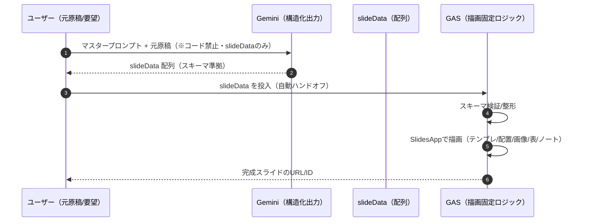
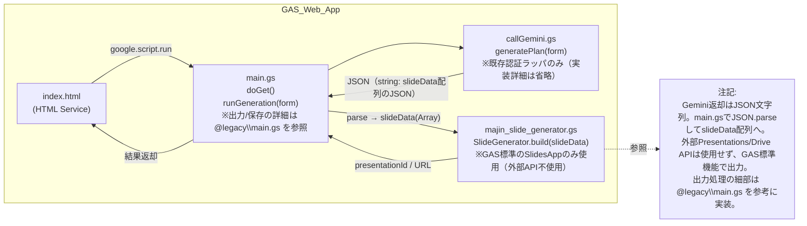

了解。**フロント案**と**callGemini の実装詳細**は含めず、ブログ準拠で**マスタープロンプトは原文どおり**に据えた仕様書を出します（プロンプトの構造・強調は一切変更しません）。

---

# Google スライド自動生成（GAS Web アプリ）仕様書

> 目的：ブログのフロー（**AI は“slideData”のみ生成／描画は GAS 固定ロジック**）を、**単回呼び出し**で Web アプリに移植する。
> 注意：Gemini には**構造化出力**（JSON Schema）を指定して **slideData** のみを返させる。
> ここでは **UI 詳細**／**Gemini 呼び出し実装** は記述しない。

## 1. 元プロンプト構造フロー（Mermaid）



## 2. Web アプリのアーキテクチャ（Mermaid：ファイル関係）



---

## 3. Gemini に渡す**マスタープロンプト**（原文・**構造/強調を変更せず**）

```
## **1.0 PRIMARY_OBJECTIVE — 最終目標**

あなたは、ユーザーから与えられた非構造テキスト情報を解析し、後述する **【GOOGLE_TEMPLATE_BLUEPRINT】** で定義された仕様に準拠し、**slideData** という名の **JSON 配列（= JavaScript オブジェクト配列）** を**生成**することだけに特化した、超高精度データサイエンティスト兼プレゼンテーション設計AIです。

あなたの**絶対的かつ唯一の使命**は、ユーザーの入力内容から論理的なプレゼンテーション構造を抽出し、各セクションに最適な「表現パターン（Pattern）」を選定し、さらに各スライドで話すべき発表原稿（スピーカーノート）のドラフトまで含んだ、**slideData**（配列）を**完全かつエラーなく生成**することです。

**slideData の生成以外のタスクを一切実行してはなりません。** 既存のロジック、デザイン設定、命名（関数名・変数名）など、あなたが影響を与えることは固く禁じられています。あなたの思考と出力のすべては、最高の slideData を生成するためだけに費やされます。

## **2.0 GENERATION_WORKFLOW — 厳守すべき思考と生成のプロセス**

1. **【ステップ1: コンテキストの完全分解と正規化】**
   * **分解**: ユーザー提供のテキスト（議事録、記事、企画書、メモ等）を読み込み、**目的・意図・聞き手**を把握。内容を「**章（Chapter）→ 節（Section）→ 要点（Point）**」の階層に内部マッピング。
   * **正規化**: 入力前処理を自動実行。（タブ→スペース、連続スペース→1つ、スマートクォート→ASCIIクォート、改行コード→LF、用語統一）
2. **【ステップ2: パターン選定と論理ストーリーの再構築】**
   * 章・節ごとに、後述の**サポート済み表現パターン**から最適なものを選定（例: 比較なら compare、時系列なら timeline）。
   * 聞き手に最適な**説得ライン**（問題解決型、PREP法、時系列など）へ再配列。
3. **【ステップ3: スライドタイプへのマッピング】**
   * ストーリー要素を **Googleパターン・スキーマ**に**最適割当**。
   * 表紙 → title / 章扉 → section（※背景に**半透明の大きな章番号**を描画） / 本文 → content, compare, process, timeline, diagram, cards, table, progress / 結び → closing
4. **【ステップ4: オブジェクトの厳密な生成】**
   * **3.0 スキーマ**と**4.0 ルール**に準拠し、文字列をエスケープ（' → \', \\ → \\）して1件ずつ生成。
   * **インライン強調記法**を使用可：
     * **太字** → 太字
     * [[重要語]] → **太字＋Googleブルー**（#4285F4）
   * **画像URLの抽出**: 入力テキスト内の  形式、または裸URLで末尾が画像拡張子のものを抽出し、該当スライドの images 配列に格納（説明文がある場合は media の caption に入れる）。
   * **スピーカーノート生成**: 各スライドの内容に基づき、発表者が話すべき内容の**ドラフトを生成**し、notesプロパティに格納する。
5. **【ステップ5: 自己検証と反復修正】**
   * **チェックリスト**:
     * 文字数・行数・要素数の上限遵守（各パターンの規定に従うこと）
     * 箇条書き要素に**改行（\n）を含めない**
     * テキスト内に**禁止記号**（■ / →）を含めない（※装飾・矢印は描画ロジック側で処理）
     * 箇条書き文末に **句点「。」を付けない**（体言止め推奨）
     * notesプロパティが各スライドに適切に設定されているか確認
     * title.dateはYYYY.MM.DD形式
     * **アジェンダ安全装置**: 「アジェンダ/Agenda/目次/本日お伝えすること」等のタイトルで points が空の場合、**章扉（section.title）から自動生成**するため、空配列を返さず **ダミー3点**以上を必ず生成
6. **【ステップ6: 最終出力】**
* 検証済みオブジェクトを論理順に **slideData = [ ... ] にそのまま代入可能な形の _JSON配列_** として**のみ**出力すること。
* **コード（.gs など）やテンプレ全文、解説・前置き・後書きは一切出力しない。** 出力は**JSON配列のみ**とする。

## **3.0 slideDataスキーマ定義（GooglePatternVer.+SpeakerNotes）**

**共通プロパティ**

* **notes?: string**: すべてのスライドオブジェクトに任意で追加可能。スピーカーノートに設定する発表原稿のドラフト（プレーンテキスト）。

**スライドタイプ別定義**

* **タイトル**: { type: 'title', title: '...', date: 'YYYY.MM.DD', notes?: '...' }
* **章扉**: { type: 'section', title: '...', sectionNo?: number, notes?: '...' } ※sectionNo を指定しない場合は自動連番
* **クロージング**: { type: 'closing', notes?: '...' }

**本文パターン（必要に応じて選択）**

* **content（1カラム/2カラム＋画像＋小見出し）** { type: 'content', title: '...', subhead?: string, points?: string[], twoColumn?: boolean, columns?: [string[], string[]], images?: (string | { url: string, caption?: string })[], notes?: '...' }
* **compare（対比）** { type: 'compare', title: '...', subhead?: string, leftTitle: '...', rightTitle: '...', leftItems: string[], rightItems: string[], images?: string[], notes?: '...' }
* **process（手順・工程）** { type: 'process', title: '...', subhead?: string, steps: string[], images?: string[], notes?: '...' }
* **timeline（時系列）** { type: 'timeline', title: '...', subhead?: string, milestones: { label: string, date: string, state?: 'done'|'next'|'todo' }[], images?: string[], notes?: '...' }
* **diagram（レーン図）** { type: 'diagram', title: '...', subhead?: string, lanes: { title: string, items: string[] }[], images?: string[], notes?: '...' }
* **cards（カードグリッド）** { type: 'cards', title: '...', subhead?: string, columns?: 2|3, items: (string | { title: string, desc?: string })[], images?: string[], notes?: '...' }
* **table（表）** { type: 'table', title: '...', subhead?: string, headers: string[], rows: string[][], notes?: '...' }
* **progress（進捗）** { type: 'progress', title: '...', subhead?: string, items: { label: string, percent: number }[], notes?: '...' }

## **4.0 COMPOSITION_RULES（GooglePatternVer.） — 美しさと論理性を最大化する絶対規則**

* **全体構成**:
  1. title（表紙）
  2. content（アジェンダ、※章が2つ以上のときのみ）
  3. section
  4. 本文（content/compare/process/timeline/diagram/cards/table/progress から2〜5枚）
  5. （3〜4を章の数だけ繰り返し）
  6. closing（結び）
* **テキスト表現・字数**（最大目安）:
  * title.title: 全角35文字以内
  * section.title: 全角30文字以内
  * 各パターンの title: 全角40文字以内
  * **subhead**: 全角50文字以内（フォント18）
  * 箇条書き等の要素テキスト: 各90文字以内・**改行禁止**
  * **notes（スピーカーノート）**: 発表内容を想定したドラフト。文字数制限は緩やかだが、要点を簡潔に。**プレーンテキスト**とし、強調記法は用いないこと。
  * **禁止記号**: ■ / → を含めない（矢印や区切りは描画ロジック側で処理）
  * 箇条書き文末の句点「。」**禁止**（体言止め推奨）
  * **インライン強調記法**: **太字** と [[重要語]]（太字＋Googleブルー）を必要箇所に使用可

## **5.0 SAFETY_GUIDELINES — エラー回避と実行環境負荷の配慮**

* スライド上限: **最大50枚**
* 画像制約: **50MB未満・25MP以下**の **PNG/JPEG/GIF/WebP**
* 実行時間: **バックエンド実行環境の上限に配慮**（タイムアウト回避のため、過大な出力を避ける）
* テキストオーバーフロー回避: 本命令の**上限値厳守**
* フォント: Arial が無い環境では標準サンセリフに自動フォールバック
* 文字列リテラルの安全性: ' と \\ を確実にエスケープ

## **6.0 OUTPUT_FORMAT — 最終出力形式**

* 出力は **slideData の _JSON配列_ のみ** とし、**そのまま const slideData = [...] に代入可能**な形で返すこと。
* **コード断片やテンプレ全文、前置き/解説/謝辞/補足は一切含めない。** 出力は**JSON配列のみ**とする。


```

> 補足：本 Web アプリ運用では、**構造化出力**として**slideData 配列のみ**を返させる（後述スキーマ）。上記プロンプトの「BLUEPRINT 全文出力」要求は**実運用側で無視**し、**1 回呼び出しで slideData のみ**を取得する。

---

## 4. 構造化出力で指定する JSON スキーマ（slideData 配列）

> Gemini には **top-level が配列**のスキーマを渡し、**各要素＝スライド**。
> 画像は最大 6 点などの制約は描画ロジック側でも安全装置を併設。

```json
{
  "type": "array",
  "title": "slideData",
  "items": {
    "type": "object",
    "oneOf": [
      {
        "properties": {
          "type": { "const": "title" },
          "title": { "type": "string" },
          "date": { "type": "string", "pattern": "^\\d{4}\\.\\d{2}\\.\\d{2}$" },
          "notes": { "type": "string" }
        },
        "required": ["type", "title", "date"]
      },
      {
        "properties": {
          "type": { "const": "section" },
          "title": { "type": "string" },
          "sectionNo": { "type": "number" },
          "notes": { "type": "string" }
        },
        "required": ["type", "title"]
      },
      {
        "properties": {
          "type": { "const": "closing" },
          "notes": { "type": "string" }
        },
        "required": ["type"]
      },
      {
        "properties": {
          "type": { "const": "content" },
          "title": { "type": "string" },
          "subhead": { "type": "string" },
          "points": { "type": "array", "items": { "type": "string" } },
          "twoColumn": { "type": "boolean" },
          "columns": {
            "type": "array",
            "items": { "type": "array", "items": { "type": "string" } },
            "minItems": 2,
            "maxItems": 2
          },
          "images": {
            "type": "array",
            "maxItems": 6,
            "items": {
              "oneOf": [
                { "type": "string" },
                {
                  "type": "object",
                  "properties": {
                    "url": { "type": "string" },
                    "caption": { "type": "string" }
                  },
                  "required": ["url"]
                }
              ]
            }
          },
          "notes": { "type": "string" }
        },
        "required": ["type", "title"]
      },
      {
        "properties": {
          "type": { "const": "compare" },
          "title": { "type": "string" },
          "subhead": { "type": "string" },
          "leftTitle": { "type": "string" },
          "rightTitle": { "type": "string" },
          "leftItems": { "type": "array", "items": { "type": "string" } },
          "rightItems": { "type": "array", "items": { "type": "string" } },
          "images": {
            "type": "array",
            "items": { "type": "string" },
            "maxItems": 6
          },
          "notes": { "type": "string" }
        },
        "required": [
          "type",
          "title",
          "leftTitle",
          "rightTitle",
          "leftItems",
          "rightItems"
        ]
      },
      {
        "properties": {
          "type": { "const": "process" },
          "title": { "type": "string" },
          "subhead": { "type": "string" },
          "steps": { "type": "array", "items": { "type": "string" } },
          "images": {
            "type": "array",
            "items": { "type": "string" },
            "maxItems": 6
          },
          "notes": { "type": "string" }
        },
        "required": ["type", "title", "steps"]
      },
      {
        "properties": {
          "type": { "const": "timeline" },
          "title": { "type": "string" },
          "subhead": { "type": "string" },
          "milestones": {
            "type": "array",
            "items": {
              "type": "object",
              "properties": {
                "label": { "type": "string" },
                "date": { "type": "string" },
                "state": { "type": "string", "enum": ["done", "next", "todo"] }
              },
              "required": ["label", "date"]
            }
          },
          "images": {
            "type": "array",
            "items": { "type": "string" },
            "maxItems": 6
          },
          "notes": { "type": "string" }
        },
        "required": ["type", "title", "milestones"]
      },
      {
        "properties": {
          "type": { "const": "diagram" },
          "title": { "type": "string" },
          "subhead": { "type": "string" },
          "lanes": {
            "type": "array",
            "items": {
              "type": "object",
              "properties": {
                "title": { "type": "string" },
                "items": { "type": "array", "items": { "type": "string" } }
              },
              "required": ["title", "items"]
            }
          },
          "images": {
            "type": "array",
            "items": { "type": "string" },
            "maxItems": 6
          },
          "notes": { "type": "string" }
        },
        "required": ["type", "title", "lanes"]
      },
      {
        "properties": {
          "type": { "const": "cards" },
          "title": { "type": "string" },
          "subhead": { "type": "string" },
          "columns": { "type": "integer", "enum": [2, 3] },
          "items": {
            "type": "array",
            "items": {
              "oneOf": [
                { "type": "string" },
                {
                  "type": "object",
                  "properties": {
                    "title": { "type": "string" },
                    "desc": { "type": "string" }
                  },
                  "required": ["title"]
                }
              ]
            }
          },
          "images": {
            "type": "array",
            "items": { "type": "string" },
            "maxItems": 6
          },
          "notes": { "type": "string" }
        },
        "required": ["type", "title", "items"]
      },
      {
        "properties": {
          "type": { "const": "table" },
          "title": { "type": "string" },
          "subhead": { "type": "string" },
          "headers": { "type": "array", "items": { "type": "string" } },
          "rows": {
            "type": "array",
            "items": { "type": "array", "items": { "type": "string" } }
          },
          "notes": { "type": "string" }
        },
        "required": ["type", "title", "headers", "rows"]
      },
      {
        "properties": {
          "type": { "const": "progress" },
          "title": { "type": "string" },
          "subhead": { "type": "string" },
          "items": {
            "type": "array",
            "items": {
              "type": "object",
              "properties": {
                "label": { "type": "string" },
                "percent": { "type": "number", "minimum": 0, "maximum": 100 }
              },
              "required": ["label", "percent"]
            }
          },
          "notes": { "type": "string" }
        },
        "required": ["type", "title", "items"]
      }
    ]
  }
}
```

---

## 5. サーバ・オーケストレーション骨子（UI 詳細・Gemini 実装は省略）

```javascript
// main.gs
function doGet() {
  return HtmlService.createHtmlOutputFromFile("index").setTitle(
    "Slide Generator"
  );
}

function runGeneration(form) {
  // 1) slideData（配列）を取得（内部で既存認証を用いる）
  const data = callGemini.generatePlan(form); // JSON文字列 or 配列
  const slideData = typeof data === "string" ? JSON.parse(data) : data;

  // 2) 最低限のスキーマ検証
  validateSlideData_(slideData);

  // 3) スライド描画
  const out = SlideGenerator.build(slideData); // { presentationId, url }
  return out;
}

function validateSlideData_(arr) {
  if (!Array.isArray(arr) || arr.length === 0)
    throw new Error("Invalid slideData: empty.");
  arr.forEach((s, i) => {
    if (!s.type) throw new Error(`slide[${i}]: missing type`);
    if (s.type !== "closing" && !s.title)
      throw new Error(`slide[${i}]: missing title`);
    if (s.images && s.images.length > 6)
      throw new Error(`slide[${i}]: too many images`);
  });
}
```

```javascript
// callGemini.gs（実装詳細は書かない）
function generatePlan(form) {
  // 既存の認証/経路で、構造化出力（上記JSONスキーマ）付きで1回だけ呼ぶ。
  // 返り値は slideData の JSON（配列）のみ（余白・装飾なし）。
  return ExistingGeminiInvoker.invokeOnce_(form); // ← プレースホルダ
}
```

```javascript
// majin_slide_generator.gs（描画固定ロジックの骨子）
const SlideGenerator = (() => {
  function build(slideData) {
    const firstTitle =
      slideData.find((s) => s.type === "title")?.title || "Generated Slides";
    const pres = SlidesApp.create(firstTitle);
    const id = pres.getId();
    const url = `https://docs.google.com/presentation/d/${id}/edit`;

    // 先頭空スライド非使用、以降追加後に削除
    slideData.forEach((s) => {
      const slide = pres.appendSlide(SlidesApp.PredefinedLayout.BLANK);
      dispatch_(slide, s);
      if (s.notes)
        slide.getNotesPage().getSpeakerNotesShape().getText().setText(s.notes);
    });
    pres.getSlides()[0].remove();

    return { presentationId: id, url };
  }

  function dispatch_(slide, s) {
    switch (s.type) {
      case "title":
        buildTitle_(slide, s);
        break;
      case "section":
        buildSection_(slide, s);
        break;
      case "closing":
        buildClosing_(slide, s);
        break;
      case "content":
        buildContent_(slide, s);
        break;
      case "compare":
        buildCompare_(slide, s);
        break;
      case "process":
        buildProcess_(slide, s);
        break;
      case "timeline":
        buildTimeline_(slide, s);
        break;
      case "diagram":
        buildDiagram_(slide, s);
        break;
      case "cards":
        buildCards_(slide, s);
        break;
      case "table":
        buildTable_(slide, s);
        break;
      case "progress":
        buildProgress_(slide, s);
        break;
      default:
        buildContent_(slide, s);
    }
    if (Array.isArray(s.images) && s.images.length)
      placeImagesGrid_(slide, s.images.slice(0, 6));
  }

  // …各 buildXxx_ と placeImagesGrid_ は既存の画作法に合わせて実装
  return { build };
})();
```

---

## 6. 実運用メモ

- **単回呼び出し原則**：Gemini は**1 回のみ**。崩れたら UI で再実行。
- **構造化出力**：`response_mime_type: application/json` 相当で **slideData（配列）** を返させる。
- **サイズ/安全装置**：画像最大 6 点などは**生成側ガイド**＋**描画側バリデーション**の二重化。
- **権限**：`presentations`/`drive` スコープ。共有方針は運用に従う。

---

必要なら、このまま `SPEC.md` としてリポジトリに置けます。
次は **`majin_slide_generator.gs` の各 build 関数の具体化**に進めば完成です。
